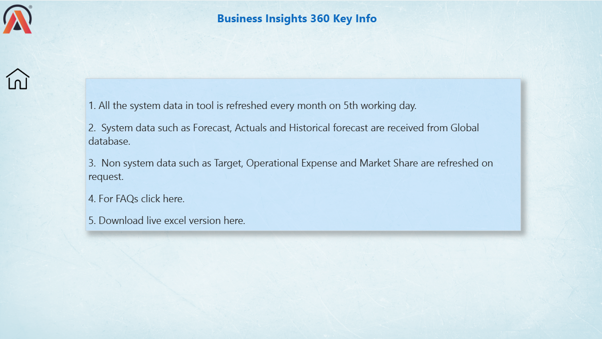
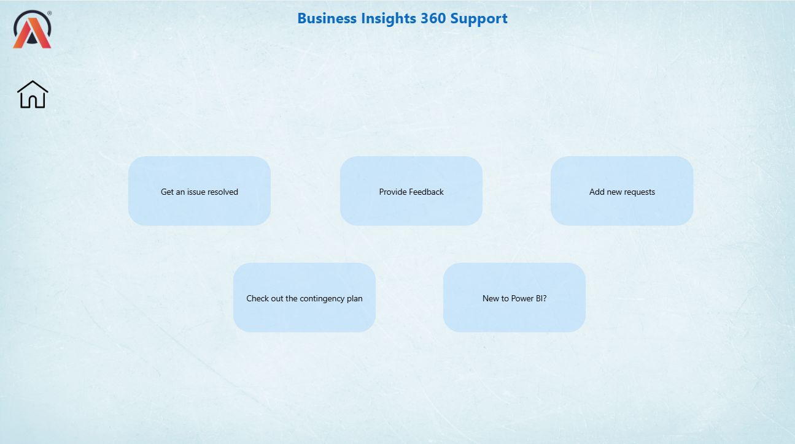

# Business-Insights-360

Power Bi Project

# Overview

AtliQ Hardwares is a top computer hardware company from India. It sells quality products like PCs, keyboards, mice, and printers around the world.

The company is known for innovation and has expanded globally, bringing new tech to homes and offices everywhere.

# Table of Contents:

● [Live Dashboard](https://app.powerbi.com/links/wsw3XU5fO1?ctid=c6e549b3-5f45-4032-aae9-d4244dc5b2c4&pbi_source=linkShare)

● [Business Model](#Business-model)

● [Problem Statement](#problem-statement)

● [Objectives](#objectives)

● [Data Model](#data-model)

● [Dashboard Preview](#dashboard-preview)

● [Key Insights](#key-Insights)

● [Recommendations](#recommendations)

# Business Model:

AtliQ sells computer hardware across different regions. The company wants to improve decision-making and performance using better data and reporting tools.

# Problem Statement:

● AtliQ tried to grow in Latin America but failed. They made decisions based only on Excel surveys and guesses.

● As the company grew fast, Excel became slow and not useful for complex decisions.

● They don’t have a strong data system, so they struggle to make fast and accurate choices.

● Their competitor, Dale, uses modern data analytics to understand customers and perform better.

# Objectives:

● Collect and analyze customer data and define KPIs (Key Performance Indicators).

● Create a dashboard using Power BI to help AtliQ with clear and fast decisions.

● Build a 360° dashboard showing important insights from Finance, Sales, Marketing, Supply Chain, and Executive View — all in one place.

● Use analytics to understand customer habits and improve products and marketing, helping AtliQ grow and compete with Dale.

# Data Model
Preview the data model used in this project.

# Dashboard preview:

# Home Page

Shows overall summary and quick access to all views.

# Info Page

Project details and navigation help.

# Support Page

Helps users understand terms and get help if needed.

# Finance View

View Profit & Loss (P&L) for any product, customer, or country, Filter by any time period

# Sales View

See how customers are performing, Check Net Sales, Gross Margin, and other key metrics

# Marketing View

Track how products are selling, Analyze Net Sales, Profit %, and Growth

# Supply Chain View

Measure Forecast Accuracy, Net Error, Check risks in product stock

# Executive View

A high-level summary dashboard for managers and executives

# Key Insights:

1) Finance View
   
● Net sales increased every year, with peaks in November–December (holiday season).

● In March 2020, sales dropped due to COVID-19.

● By 2022, sales nearly hit the target (missed by just 1.5%).

● Net profit dropped slightly due to company expansion.

● Gross margin dropped in 2020 but recovered well by 2022, showing strong growth.

2) Sales View:
 
● Cost of Goods Sold (COGS) and Gross Margin stayed around 60:40 ratio.

● Amazon, AtliQ Exclusive, and e-Store had the highest sales.

● In 2022, Amazon and e-Store missed the Gross Margin % target.

● Some regions (like the Philippines, Germany, Brazil, etc.) performed below the 10% GM% target range.

3) Marketing View:

● Notebooks had the highest Net Sales in all years.

● Desktops weren't sold in 2019 but grew well in Net Profit % and GM% after.

● Networking products had the best Net Profit %.

● Keyboards and laptops were the most sold products.

4) Supply Chain View
   
● Accessories (especially keyboards) often went out of stock due to high demand.

● Desktops had too much stock, likely because laptops were selling more.

● November and December had the most net errors (stockouts or overstock).

● Forecast accuracy dropped during COVID-19 but improved by 2022.

5) Executive View 

● In 2022, PCs gave the highest revenue (61%), followed by Accessories (36%) and Networking & Storage (2.5%).

● Most revenue came from retailers (71%), then direct sales (18%), and distributors (10%).

● Amazon was the top customer, and laptop variants from the Desktop segment sold the most.

● Three regions gave 75% of total revenue: North America (27%), India (25%), and Rest of Asia (21%).

● AtliQ entered the market in 2020 and reached a 5.9% share by 2022, while Dale led with 22%.

● Year by year, sales and market share increased, but from 2021, net profit dropped a little.

# Recommendations

● Improve supply chain to reduce stockouts (Accessories) and overstock (Desktops).

● Focus on underperforming regions like Brazil, Germany, and Philippines with better pricing and promotions.

● Invest in better forecasting tools to handle peak months like November & December.

● Strengthen retail partnerships (since they bring 71% revenue), but also grow direct and distributor sales.

● Compete better with Dale by adding new features, better pricing, and strong marketing.

● Invest more in top-performing segments like Notebooks and Networking and expand high-demand products like laptops and accessories.
